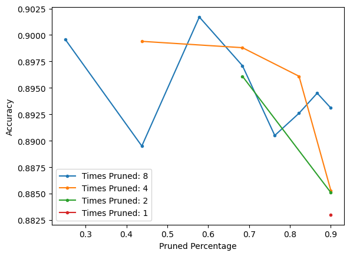
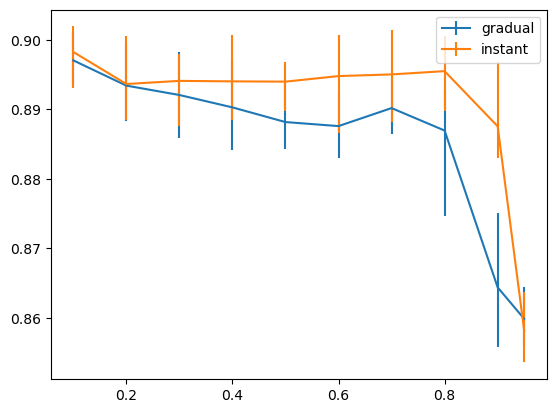

# Pruning with Pytorch

## Getting started

When cloning this project, be sure to enable the option --recurse-submodules. Otherwise, pytorch_resnet_cifar10 must also be cloned into its proper location.

To get familiar with the code, gradual_pruning.ipynb and gradual_vs_instant.ipynb are a great start.

### Dependencies

* pytorch
* numpy
* matplotlib
* jupyter
* cuda (not required, but highly recommended)

---

## The project

This project contains 

* utility files

  * model_utils.py has several functions that are useful for pruning a pytorch model

  * pruning.py defines different pruning algorithms

* testing files
  * gradual_vs_instant.ipynb compares gradual pruning to instant pruning
  * gradual_pruning.ipynb tests the accuracy of a model as it is being pruned gradually

### Features

- [x] Global Magnitude Weight Unstructured Pruning
- [ ] Global Magnitude Gradient Unstructured Pruning
- [ ] Layerwise pruning
- [ ] Structured Pruning
- [x] Threshold Pruning
- [x] Tests on Gradual Pruning
- [x] Obtain accury of model on dataset
- [x] Determine how much of a model is pruned
- [x] Apply the pruning to a model permanently
- [ ] Save a pruned model

## Results from Testing

### [gradual pruning](gradual_pruning.ipynb)

This test was created to determine if gradual pruning is viable.   Gradual pruning is when the model is repeatedly pruned and trained after each prune. This test seems to conclude that gradual pruning is beneficial. Below is a graph of the results:

As one can see, pruning the model eight times and training after each prune resulted in a more accurate model than pruning the model just once and training that pruned model with the same amount of resources.
Pruning the model a total of two or four times did better than just pruning once, but worse than pruning eight times. More details about this test can be found in [gradual_pruning.ipynb](gradual_pruning.ipynb)

It is also noticable that the lines are quite jagged, so we sought to do more testing by running a similar experiment many times, that being gradual vs. instant pruning.

### [gradual vs. instant pruning](gradual_vs_instant.ipynb)

Instant pruning is when a model is just pruned once, then is trained.
This test showed that gradual pruning is not always better than instant pruning. Below are this test's results:

Here, it seems that not only does instant pruning perform better on average, but some of its worst performances (indicated by the error bars) are better than gradual pruning's average. However, instant pruning seems to perform about the same as gradual when 95% of the model is pruned (this is indicated by the last datapoint). More details about this test can bee found in [gradual_vs_instant.ipynb](gradual_vs_instant.ipynb).
